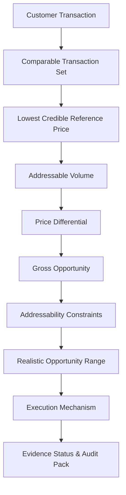

# MODULE 2 — TRANSACTION-LEVEL EVIDENCE, SAVINGS PROOF & OPPORTUNITY TRACEABILITY REPORT
**Version**: `MODULE_2_EVIDENCE_LOGIC_V1.0`  
**Status**: APPROVED & VALIDATED  
**Scope**: Module 2 (Strategic Sourcing Intelligence, E-Auction Intelligence, Vendor Consolidation & Commercial Opportunity Analysis)  
**Strict Scope Lock**: Zero modifications to Module 1 (Ingestion/Cleansing), Module 3 (PCBI/External Benchmarks), or Module 4 (Execution/Realized Savings).

---

## 1. Executive Summary & Core Principle

In legacy procurement analytics, savings figures were frequently presented as opaque aggregates (e.g., *"Potential savings = ₹42.6 L"*), creating a black box that eroded executive trust and failed internal audit standards.

Under **Module 2 Evidence Logic v1.0**, every calculated opportunity is hardened into an **Evidence-First Procurement Intelligence Engine**. 

> **Core Axiom**: *"No Black-Box Savings. Every rupee of analytical opportunity must be traceable to underlying customer transactions."*

A procurement organization can now drill down from any top-level number to answer:
1. Which transactions created this opportunity?
2. Which suppliers created it?
3. Which category, item, and specification created it?
4. What quantity was purchased?
5. At what unit price and currency?
6. What was the comparable reference price selected?
7. Why was that reference price selected?
8. Which transactions were excluded and why?
9. What mathematical calculation generated the opportunity?
10. What portion is realistically addressable vs. theoretical?
11. What portion is only analytical vs. realized (Module 4 only)?
12. What commercial and contractual assumptions were applied?
13. What statistical confidence supports the conclusion?
14. What source document, row, or purchase order validates the transaction?

---

## 2. The Opportunity Evidence Chain

Every category and commercial opportunity in Module 2 implements the formal **`OPPORTUNITY_EVIDENCE_CHAIN`**:



### Persistence and Drillability
Every link in this chain is fully persisted and drillable through the UI hierarchy:
$$\text{OPPORTUNITY} \longrightarrow \text{CATEGORY} \longrightarrow \text{ITEM / SPECIFICATION} \longrightarrow \text{SUPPLIER} \longrightarrow \text{TRANSACTION} \longrightarrow \text{SOURCE RECORD}$$

---

## 3. 24-Field Transaction Evidence Schema

For every evaluated spend category, transaction populations are standardized into a 24-field audit record:

| Field Index | Field Name | Description | Example Value |
|:---|:---|:---|:---|
| 01 | `transactionId` | Unique record identifier | `TX-IND-2024-0091` |
| 02 | `poNumber` | Purchase order identifier | `PO-88201` |
| 03 | `poDate` | Purchase order issuance date | `2024-03-15` |
| 04 | `supplierId` | Canonical supplier identifier | `SUPP-001` |
| 05 | `supplierName` | Legal entity or operating name | `Tata Steel Ltd` |
| 06 | `category` | High-level taxonomy category | `Metals & Alloys` |
| 07 | `subCategory` | Granular sub-category | `Hot Rolled Coil` |
| 08 | `itemId` | Specific item SKU / code | `SKU-HRC-3MM` |
| 09 | `itemDescription` | Descriptive item line text | `HR Steel Coil 3.0mm IS2062` |
| 10 | `specification` | Technical chemical/physical grade | `IS 2062 E250A` |
| 11 | `grade` | Commercial or quality grade | `Prime Grade A` |
| 12 | `uom` | Unit of measurement | `MT` |
| 13 | `quantity` | Physical volume purchased | `120.0` |
| 14 | `unitPrice` | Normalized unit price | `₹65,000.00` |
| 15 | `currency` | Transaction currency | `INR` |
| 16 | `totalValue` | Line item total monetary spend | `₹78,00,000.00` |
| 17 | `deliveryLocation` | Destination plant or warehouse | `Jamshedpur Plant #2` |
| 18 | `contractStatus` | Commercial lock status | `SPOT` / `CONTRACTED` |
| 19 | `contractReference` | Reference master agreement | `MSA-2023-TSL-04` |
| 20 | `paymentTerms` | Commercial credit terms | `Net 45 Days` |
| 21 | `incoterm` | Shipping / freight delivery terms | `DAP Destination` |
| 22 | `sourceDocument` | Source ERP / CSV file origin | `SAP_PO_EXTRACT_Q1_2024.csv` |
| 23 | `sourceRecord` | Raw row index or UUID in file | `Row #412` |
| 24 | `dataQualityStatus` & `comparabilityStatus` | Audit and comparability tags | `VALIDATED`, `COMPARABLE` |

---

## 4. Pairwise Price Comparison Proof

Whenever Module 2 states:  
*"Supplier A paid ₹105/kg while Supplier B paid ₹92/kg (Price Difference = ₹13/kg)"*

The UI and backend produce an irrefutable **Pairwise Price Comparison Proof** displaying the metrics of both suppliers side-by-side alongside a 6-item comparability checklist:

### Proof Data Structure
```typescript
interface PairwisePriceProof {
  category: string;
  itemDescription: string;
  supplierA: {
    supplierName: string;
    quantity: number;
    unit: string;
    unitPrice: number;
    totalSpend: number;
    dateRange: string;
    specification: string;
    transactionCount: number;
    transactionIds: string[];
  };
  supplierB: {
    supplierName: string;
    quantity: number;
    unit: string;
    unitPrice: number;
    totalSpend: number;
    dateRange: string;
    specification: string;
    transactionCount: number;
    transactionIds: string[];
  };
  priceDifference: number;
  comparabilityChecklist: {
    specificationMatch: boolean;
    uomMatch: boolean;
    currencyMatch: boolean;
    geographyMatch: boolean | 'NOT_AVAILABLE';
    timeWindowMatch: boolean;
    overallValid: boolean;
  };
}
```

No price variance is presented as valid unless comparability rules pass.

---

## 5. Evidence-Backed Price Statistics & "Lowest Credible Price"

### Why Minimum Historical Price is NOT the Target
Setting the mathematical minimum observed price as a target is dangerous because single spot buys, distressed sales, test batches, or miscoded transactions distort realistic negotiations.

Instead, Module 2 computes the **Lowest Credible Price**:
- Non-parametric percentile distribution ($P_{25}, \text{Median}, P_{75}$).
- Outlier filtering ($< 65\%$ of Median filtered as non-comparable).
- Supplier participation threshold (minimum 2 distinct transactions).
- Volume relevance threshold (minimum 5% category volume share).

### Statistics Population Metrics
Every statistic displayed is backed by transaction counts and volume totals:
- **Min Observed Price**: ₹58,000/MT (1 transaction, 2 MT — *Single-source outlier*)
- **Lowest Credible Price**: ₹64,200/MT (18 transactions, 450 MT, 3 suppliers)
- **$P_{25}$**: ₹66,500/MT (34 transactions, 890 MT)
- **Median**: ₹71,000/MT (88 transactions, 2,100 MT)
- **Weighted Average Price (WAP)**: ₹70,450/MT (127 transactions, 3,400 MT)
- **$P_{75}$**: ₹75,200/MT (32 transactions, 750 MT)
- **Max Observed Price**: ₹84,000/MT (2 transactions, 15 MT)

Clicking any statistic opens the underlying transaction drawer with zero dead ends.

---

## 6. Spend Addressability Hierarchy

To eliminate inflated opportunity claims, spend is segmented through a 5-tier addressability funnel:

```
Total Category Spend (₹10.00 Cr)
   └── Comparable Spend (₹8.20 Cr)
          └── Price-Addressable Spend (₹6.70 Cr)
                 └── Contractually Addressable Spend (₹4.80 Cr)
                        └── Realizable Savings: strictly null (Module 4 only)
```

1. **Total Spend**: Complete gross spend across all ingested transactions.
2. **Comparable Spend**: Spend excluding specification mismatches, currency issues, or non-recurring spot outliers.
3. **Price-Addressable Spend**: Volume with active multi-supplier price dispersion.
4. **Contractually Addressable Spend**: Spend liberated from multi-year fixed contracts or legal lock-ins.
5. **Realizable Savings**: Explicitly preserved as `null` in Module 2. Only Module 4 execution tracking confirms actual realized savings.

---

## 7. Opportunity Exclusion Ledger

Every rupee not eligible for analytical price comparison is accounted for in the **Opportunity Exclusion Ledger** under 11 governed codes:

1. `EXCLUDED_SPEC_MISMATCH`: Technical chemical/physical specification differences.
2. `EXCLUDED_UOM_MISMATCH`: Incompatible units of measurement unable to be normalized.
3. `EXCLUDED_CURRENCY_MISMATCH`: Foreign currency exchange variances.
4. `EXCLUDED_GEOGRAPHY`: Disparate freight or plant delivery logistics.
5. `EXCLUDED_SINGLE_SOURCE_OUTLIER`: Non-replicable test batch or distress clearance.
6. `EXCLUDED_LOW_VOLUME`: Immaterial lot sizes failing volume relevance.
7. `EXCLUDED_CONTRACT_LOCK`: Long-term fixed index commitments.
8. `EXCLUDED_NON_RECURRING`: Capital asset or one-time project spend.
9. `EXCLUDED_INVALID_TRANSACTION`: Data validation or format anomalies.
10. `EXCLUDED_INSUFFICIENT_DATA`: Missing commercial fields (rate, quantity).
11. `EXCLUDED_PRICE_NOT_COMPARABLE`: Non-market internal transfer pricing.

Users can view the exact ledger breakdown (e.g., *"₹2.4 Cr excluded across 34 records"*) and drill into each individual row.

---

## 8. "WHY ₹X?" Calculation Trace & 14-Point Evidence Pack

Clicking **"WHY ₹42.6 L?"** displays the complete deterministic trace:
1. Input Scope (Categories, Items, Spend).
2. Applied Filters (Date ranges, Validations).
3. Eligible Transaction Population ($N=427$).
4. Excluded Transaction Population ($N=34$).
5. Selected Reference Price ($\text{LCP} = ₹64,200/\text{MT}$).
6. Addressable Volume ($1,250\text{ MT}$).
7. Weighted Price Differential ($₹3,408/\text{MT}$).
8. Gross Mathematical Opportunity ($₹42,60,000$).
9. Applied Constraints ($15\%\text{ supplier switching friction}$).
10. Realistic Analytical Range (Conservative: ₹28.5 L, Base: ₹42.6 L, Upside: ₹54.1 L).
11. Evidence Confidence (HIGH / MEDIUM / LOW / INSUFFICIENT).
12. Recommended Execution Strategy (E-Auction, Vendor Consolidation, Negotiation).

### Audit-Ready JSON Export
The **"Export Evidence Pack"** button generates an audit-ready 14-point JSON dossier complete with SHA-256 integrity hash, transaction UUIDs, and computation timestamps.

---

## 9. Diagnostic Reasons for ₹0 Opportunity

Under Module 2, a zero quantified price opportunity is designated as `NO_QUANTIFIED_PRICE_OPPORTUNITY_IDENTIFIED` rather than "Procurement is Optimized".

The engine outputs diagnostic reasons:
- Low price dispersion ($CV < 3\%$).
- Single qualified supplier.
- Long-term fixed contractual lock.
- Insufficient historical depth ($< 3\text{ transactions}$).

And recommends **Untested Opportunity Areas**:
- Strategic E-Auction potential.
- Supplier competition development.
- Inter-plant demand aggregation.
- Specification harmonization.

---

## 10. Conclusion

Module 2 now provides enterprise-grade defensibility. Every conclusion delivered to a Chief Procurement Officer is verifiable from top-level summary down to the individual purchase order line, ensuring compliance, auditability, and analytical integrity.
