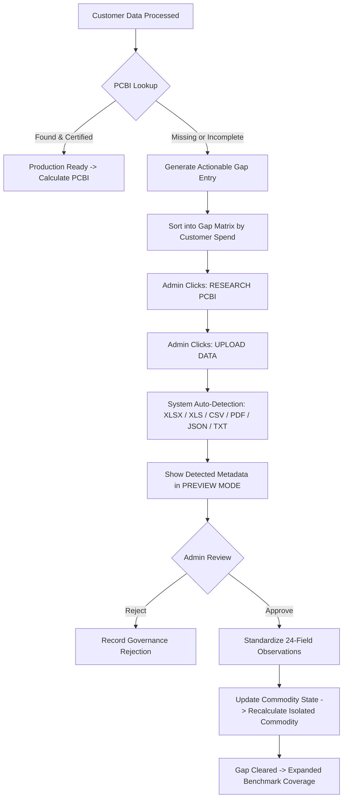

# PCBI Module 3 — Administrator PCBI Research & Dynamic Expansion Workflow (V1.6)

## Executive Summary
This document provides the standard operating procedures and governance guide for Procurement Administrators, Category Managers, and Data Stewards operating **Module 3 (PCBI Calculation Engine)** under **Controlled Pilot Mode**.

---

## 1. Operating Principles & Non-Blocking Architecture

1. **Continuous Expansion**: Software operates continuously with certified commodities. Missing commodities do NOT stop valid calculations.
2. **Dynamic Commodity States**: A commodity exists in one of 10 granular states:
   - `PCBI_MISSING`
   - `PCBI_DEFINED_NO_HISTORY`
   - `PARTIAL_HISTORY`
   - `SOURCE_UNVERIFIED`
   - `METHODOLOGY_PENDING`
   - `SPECIFICATION_MISMATCH`
   - `FREQUENCY_MISMATCH`
   - `READY_FOR_CALCULATION`
   - `PRODUCTION_READY`
   - `NOT_BENCHMARKABLE`
3. **Strict Isolation**: Updating or approving a blocked commodity recalculates **only the affected commodity**. The system never triggers unneeded global reruns.
4. **Zero Savings Boundary**: Under Controlled Pilot Mode, all savings, recovery calculations, and supplier rankings are strictly **ZERO**.

---

## 2. Gap Research Queue & Prioritization

The Live Customer Gap Matrix is sorted primarily by **Customer Spend (INR)** to maximize commercial impact:
- **P1_CRITICAL (Spend > ₹1.0 Cr with 0m history)**: Immediate research action required.
  - *Ferro Molybdenum 65%* (Spend: ₹1.25 Cr, Txns: 6) -> Action: `[CREATE PCBI]`
  - *Industrial Slurry Pumps & Impellers* (Spend: ₹1.03 Cr, Txn: 1) -> Action: `[UPLOAD HISTORY]`
- **P2_HIGH (Partial history or unapproved frequency)**:
  - *Carbide Cutting Inserts* (Spend: ₹0.77 Cr, 42m history) -> Action: `[APPEND HISTORY]`
  - *HDPE Granules 5502* (Spend: ₹0.30 Cr, Fortnightly feed) -> Action: `[ADD METHODOLOGY]`
- **P3_MEDIUM (Methodology or specification mismatch)**:
  - *Stainless Steel 304 Scrap* (Spend: ₹0.28 Cr) -> Action: `[VALIDATE METHODOLOGY]`
  - *Hydraulic Oil VG 46* (Spend: ₹0.18 Cr) -> Action: `[ADD SOURCE]`
- **P4_LOW (Certified production series or excluded services)**:
  - *HR Steel, Kraft Paper, TMT Rebars, SS Pipes, Copper, Caustic Soda* -> Status: `PRODUCTION_READY`
  - *Plant Engineering Services* -> Status: `NOT_BENCHMARKABLE`

---

## 3. End-to-End Admin Research Workflow

---

## 4. Supported Ingestion Formats & Auto-Detection Engine

The admin portal supports 6 primary file formats:
- **XLSX / XLS**: Multi-sheet workbook parsing with automatic header row recognition.
- **CSV**: Delimited observation files.
- **PDF**: Document table extraction with layout preservation.
- **JSON**: Structured API feeds and public data endpoints.
- **TXT**: Fixed-width and tab-delimited market reports.

### Auto-Detected Metadata Fields:
1. **Date Column & Period**: Auto-detected date range (e.g., `2020-04-01 to 2026-06-30`).
2. **Benchmark Price Column**: Identified settlement, cash, or index value column.
3. **Unit & Currency**: E.g., `INR/MT`, `USD/MT`, `EUR/MT`, `INDEX_POINTS`.
4. **Observation Frequency**: `DAILY`, `WEEKLY`, `FORTNIGHTLY`, `MONTHLY`, `QUARTERLY`.
5. **Commodity, Grade, Specification & Geography**: Extracted from headers or document metadata.
6. **Provenance Checksum**: SHA-256 hash computed immediately on upload.

> **CRITICAL RULE**: System displays all detected parameters in **PREVIEW MODE**. The platform **NEVER** silently approves or ingests external observations.

---

## 5. Frequency Governance & Conversion Controls

- **Weekly -> Weekly**: `DIRECT` (Allowed).
- **Monthly -> Monthly**: `DIRECT` (Allowed).
- **Fortnightly -> Weekly**: `BLOCKED` until approved methodology formula.
- **Monthly -> Weekly**: `BLOCKED` until approved methodology formula.
- **Quarterly -> Monthly**: `BLOCKED` until approved methodology formula.
- **Forbidden Practices**: Silent interpolation, synthetic observation generation, and arbitrary averaging are **STRICTLY PROHIBITED**.

---

## 6. Standardized 24-Field Observation Record

Every observation stored in the PCBI catalog must preserve:
1. `PCBI_ID`
2. `COMMODITY_ID`
3. `SERIES_ID`
4. `SOURCE_NAME`
5. `SOURCE_DATE`
6. `EFFECTIVE_DATE`
7. `RAW_VALUE`
8. `RAW_UNIT`
9. `RAW_CURRENCY`
10. `STANDARD_VALUE`
11. `STANDARD_UNIT`
12. `STANDARD_CURRENCY`
13. `SOURCE_FREQUENCY`
14. `STANDARD_FREQUENCY`
15. `GEOGRAPHY`
16. `GRADE`
17. `SPECIFICATION`
18. `TRANSFORMATION_METHOD`
19. `METHODOLOGY_ID`
20. `INGESTION_BATCH_ID`
21. `CHECKSUM`
22. `VALIDATION_STATUS`
23. `VERSION`
24. `APPROVED_BY` & `APPROVED_AT`

Historical observations are **IMMUTABLE**; subsequent updates append new observation batches under unique batch IDs.

---

## 7. Display Normalization Policy in Analytical Preview

When viewing analytical previews:
- **Customer Metrics**: Distinctly displayed in Customer Purchase Currency (**INR ₹**) and invoice unit (e.g., `₹66,678.25/MT`).
- **PCBI Metrics**: Distinctly displayed in source currency and standardized unit (e.g., Base: `₹36,500.00/MT`, Current: `₹54,750.00/MT`, Index: `150.00`).
- **Prominent Disclaimer**: Mandatory badge `"ANALYTICAL PREVIEW — NOT SAVINGS"`.
- **Monetary Recovery / Savings**: Must remain strictly **₹0.00** until Module 4 commercial activation.
